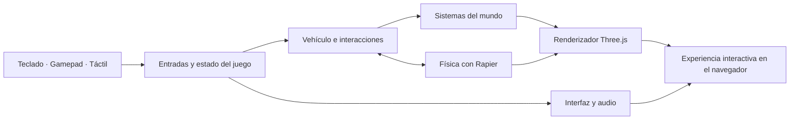

<div align="center">

### Idioma de la documentación

[](./README.md)
[](./README.es.md)

<br />

# Base para un portafolio 3D interactivo

### Una base con experiencia de juego para construir un portafolio explorable en la web.

[](https://threejs.org/)
[](https://rapier.rs/)
[](https://vite.dev/)
[](https://www.khronos.org/webgl/)

</div>


<p align="center"><sub>Concepto visual creado a partir del mundo, el vehículo, la paleta y la dirección de arte low-poly del proyecto.</sub></p>

## Construye un portafolio que las personas puedan explorar

Este proyecto cambia el portafolio tradicional de solo desplazamiento vertical por un pequeño mundo interactivo. Los visitantes conducen por el entorno, descubren zonas de contenido, abren proyectos, completan actividades y recorren un lugar que cambia con el tiempo y el clima.

Está pensado como **punto de partida para una experiencia nueva**. Antes de publicarlo, reemplaza el contenido, la identidad visual, los recursos del mundo, los enlaces y los textos actuales por los tuyos.

<table>
  <tr>
    <td width="33%" valign="top">
      <h3>Explorar</h3>
      <p>Un mundo abierto y conducible conecta proyectos, experimentos, enlaces sociales y zonas interactivas.</p>
    </td>
    <td width="33%" valign="top">
      <h3>Interactuar</h3>
      <p>Física, logros, actividades, notificaciones, audio y varios métodos de control hacen más entretenida la visita.</p>
    </td>
    <td width="33%" valign="top">
      <h3>Evolucionar</h3>
      <p>El día, las estaciones, la iluminación, la niebla, el viento, la lluvia y la nieve crean una atmósfera viva.</p>
    </td>
  </tr>
</table>

## La experiencia de un vistazo

<table>
  <tr>
    <td width="50%" align="center">
      
    </td>
    <td width="50%" align="center">
      
    </td>
  </tr>
  <tr>
    <td align="center"><strong>Controles flexibles</strong><br /><sub>Teclado, gamepad, controles táctiles e interacciones con puntero.</sub></td>
    <td align="center"><strong>Progreso por descubrir</strong><br /><sub>Los logros y las actividades recompensan la exploración.</sub></td>
  </tr>
</table>

### Un mundo, distintos ambientes

<table>
  <tr>
    <td width="50%" align="center">
      
    </td>
    <td width="50%" align="center">
      
    </td>
  </tr>
  <tr>
    <td align="center"><strong>Día</strong></td>
    <td align="center"><strong>Noche</strong></td>
  </tr>
</table>

### Espacio para experimentar


El mundo ya incluye zonas para proyectos, experimentos de laboratorio, desafíos, un altar de logros, un circuito y otros descubrimientos interactivos. Puedes reutilizar, reducir o reemplazar estos módulos para crear un portafolio completamente nuevo.

## Lo que ya incluye

- Exploración en vehículo con conducción tipo arcade y puntos de reaparición.
- Renderizado 3D en tiempo real con Three.js y materiales basados en nodos.
- Física con Rapier para el vehículo, las colisiones, los objetos y las interacciones.
- Ciclos del día y del año conectados con el clima, la iluminación, la niebla, la vegetación y el terreno.
- Lluvia, nieve, viento, relámpagos, agua, huellas, rastros y efectos ambientales.
- Zonas de proyectos, laboratorio, circuito, bolos, redes, mapa, menú y logros.
- Sistemas de entrada para teclado, gamepad, controles táctiles y puntero.
- Música, efectos, audio espacial, notificaciones e indicadores interactivos.
- Flujo de optimización para GLB, texturas, KTX y WebP.
- Conexión WebSocket opcional para funciones en línea.

## Cómo se conectan las partes



| Capa | Responsabilidad |
| --- | --- |
| Experiencia | Introducción, menús, mapa, controles, notificaciones, proyectos y paneles de contenido |
| Jugabilidad | Jugador, vehículo, interacciones, actividades, logros y puntos de reaparición |
| Mundo | Zonas, terreno, objetos, vegetación, ciclos, clima, iluminación y efectos |
| Motor | Tiempo, recursos, entradas, física, audio, cámara, renderizado y monitoreo |
| Flujo de recursos | Compilación con Vite, procesamiento de modelos 3D, compresión de texturas y entrega estática |

## Inicio rápido

### Requisitos

- [Node.js](https://nodejs.org/) 20.19 o superior, o 22.12 o superior.
- npm.
- Un navegador moderno con soporte para WebGL.

### Instalar y ejecutar

```bash
git clone <url-de-tu-repositorio>
cd <carpeta-de-tu-proyecto>
npm install --force
npm run dev
```

Abre la dirección local que muestre Vite, normalmente `http://localhost:5173`.

> Actualmente se necesita `--force` porque un complemento de desarrollo declara compatibilidad con una versión anterior de Vite. Revisa y actualiza ese complemento antes de usar esta base en producción a largo plazo.

### Compilación para producción

```bash
npm run build
npm run preview
```

El resultado optimizado se genera en `dist/`.

## Controles principales

| Acción | Teclado | Gamepad |
| --- | --- | --- |
| Moverse | `WASD` o flechas | Palanca izquierda / controles direccionales |
| Impulso | `Shift` | Círculo / botón frontal equivalente |
| Frenar | `B` o `Ctrl` izquierdo | Cuadrado / botón frontal equivalente |
| Salto / acción de suspensión | `Espacio` | Triángulo / botón frontal equivalente |
| Interactuar | `Enter`, `E` o `F` | Cruz / botón frontal principal |
| Reaparecer | `R` | Botón Select / vista |
| Abrir el mapa | `M` | Disponible desde la interfaz |
| Cambiar la vista | `V` | Disponible desde la interfaz |
| Cerrar un panel | `Esc` | Botón frontal principal |

Los controles táctiles aparecen automáticamente en dispositivos compatibles. Las entradas disponibles también pueden cambiar según la actividad o el estado de la interfaz.

## Configuración del entorno

Crea un archivo `.env` en la raíz del proyecto cuando necesites modificar el comportamiento de ejecución.

| Variable | Propósito |
| --- | --- |
| `VITE_GAME_PUBLIC` | Activa el flujo de la experiencia pública. |
| `VITE_COMPRESSED` | Carga las variantes comprimidas de modelos y texturas. |
| `VITE_MUSIC` | Activa la música de fondo. |
| `VITE_SERVER_URL` | Dirección WebSocket utilizada por las funciones en línea opcionales. |
| `VITE_WHISPERS_COUNT` | Define la cantidad de mensajes generados dentro del mundo. |
| `VITE_PLAYER_SPAWN` | Selecciona el punto inicial de reaparición; por defecto es `landing`. |
| `VITE_DAY_CYCLE_PROGRESS` | Fuerza un valor del ciclo diario para realizar pruebas. |
| `VITE_YEAR_CYCLE_PROGRESS` | Fuerza un valor del ciclo anual para realizar pruebas. |
| `VITE_LOG` | Activa registros adicionales en la consola. |
| `VITE_ANALYTICS_TAG` | Entrega la etiqueta de medición analítica usada por la plantilla de la página. |

Ejemplo para desarrollo:

```dotenv
VITE_GAME_PUBLIC=true
VITE_WHISPERS_COUNT=0
```

En el código actual, las variables que funcionan como indicadores booleanos se activan cuando contienen cualquier valor no vacío. Para desactivar `VITE_COMPRESSED` o `VITE_MUSIC`, déjalas sin definir en lugar de asignarles `false`.

No guardes secretos en Git. Las variables que comienzan por `VITE_` quedan expuestas en el paquete enviado al navegador.

## Estructura del proyecto

```text
.
├── docs/images/       Imágenes y vistas previas del README
├── resources/         Recursos fuente utilizados durante la creación
├── scripts/           Utilidades para procesar recursos
├── sources/           Aplicación, interfaz, estilos y sistemas del juego
│   └── Game/          Módulos de renderizado, física, entradas, mundo y jugabilidad
├── static/            Modelos, texturas, audio, tipografías y recursos públicos
├── vite.config.js     Configuración de desarrollo y producción
└── package.json       Comandos y dependencias de JavaScript
```

## Flujo de recursos

Conserva los archivos fuente editables separados de las versiones preparadas para el navegador. Después de exportar los recursos 3D sin comprimir, ejecuta:

```bash
npm run compress
```

El script de compresión recorre `static/` y puede:

- Crear variantes GLB optimizadas sin reemplazar sus archivos fuente.
- Codificar texturas de modelos en formatos KTX aptos para la GPU.
- Convertir las imágenes de la interfaz a WebP.
- Aplicar configuraciones de compresión según la ruta.

El script depende de herramientas externas de los ecosistemas glTF Transform y Khronos KTX. Revisa `scripts/compress.js` antes de ejecutarlo sobre recursos nuevos.

## Conviértelo en tu propio proyecto

Antes de publicar un portafolio nuevo, planea reemplazar como mínimo:

1. Metadatos de la página, textos, proyectos, enlaces e información de contacto.
2. Logos, imágenes sociales, identidad de la interfaz, tipografías y decisiones de color.
3. Modelos del mundo, texturas, audio, pantallas de proyectos y contenido del laboratorio.
4. Analítica, direcciones del servidor, variables del entorno y configuración de despliegue.
5. Avisos de licencia y atribuciones de terceros de acuerdo con sus condiciones originales.

Comienza con una zona, un proyecto y un recorrido claro para el visitante. Cuando ese camino funcione bien, amplía el mundo sin volver más difícil de entender la primera visita.

## Consideraciones de rendimiento

Esta es una experiencia 3D en tiempo real de gran tamaño, por lo que la primera carga es más pesada que la de un portafolio convencional. Para una versión de producción:

- Activa los recursos comprimidos y prueba en dispositivos móviles de gama media.
- Elimina zonas, modelos, audios y dependencias que no vayas a utilizar.
- Separa las experiencias opcionales que no formen parte del recorrido inicial.
- Mide carga, memoria, fotogramas por segundo y consumo de batería en dispositivos reales.
- Incluye un estado de carga claro y una alternativa más simple cuando sea conveniente.

## Licencia y atribución

Revisa [`license.md`](./license.md) y cada licencia o atribución incluida con los recursos antes de redistribuir o publicar esta base. Conserva todos los avisos exigidos por el código, las tipografías, los modelos, las texturas, el audio y las bibliotecas de terceros originales.

---

<div align="center">

**Una base sólida para crear un portafolio interactivo completamente nuevo.**

[](./README.md)
[](./README.es.md)

</div>
