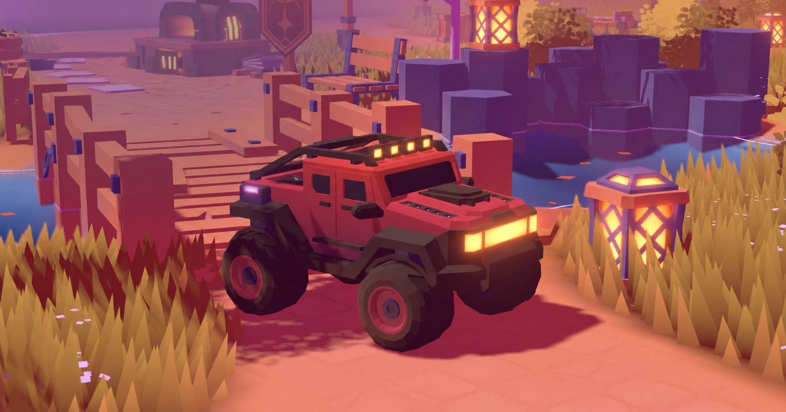
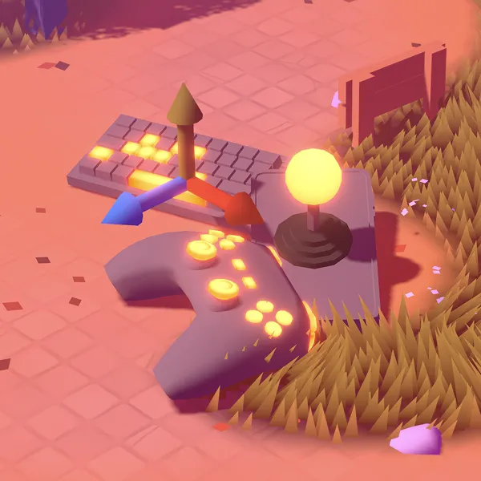
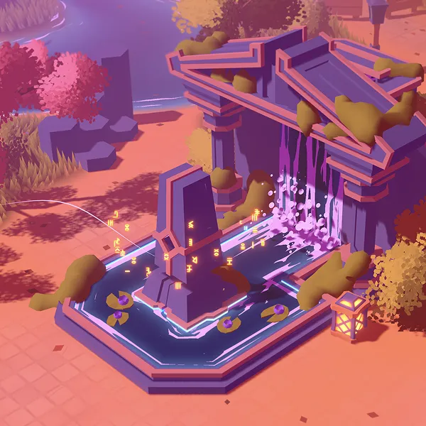
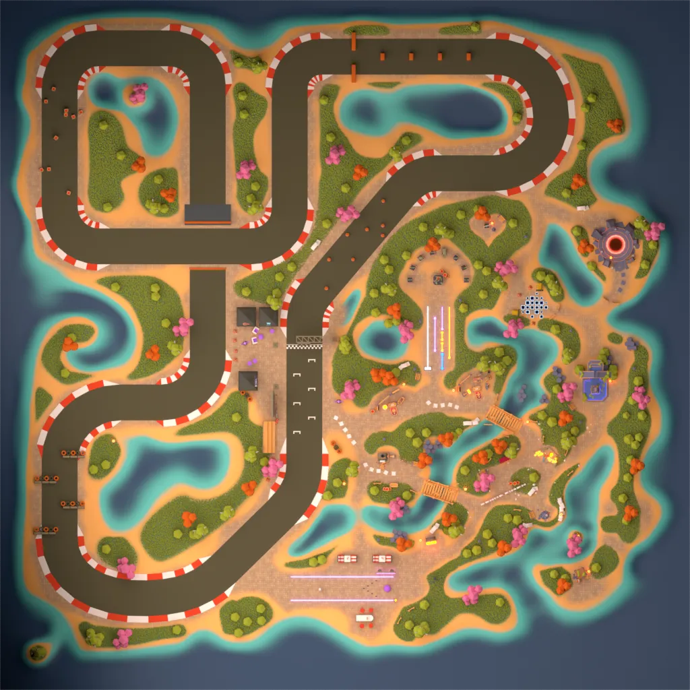
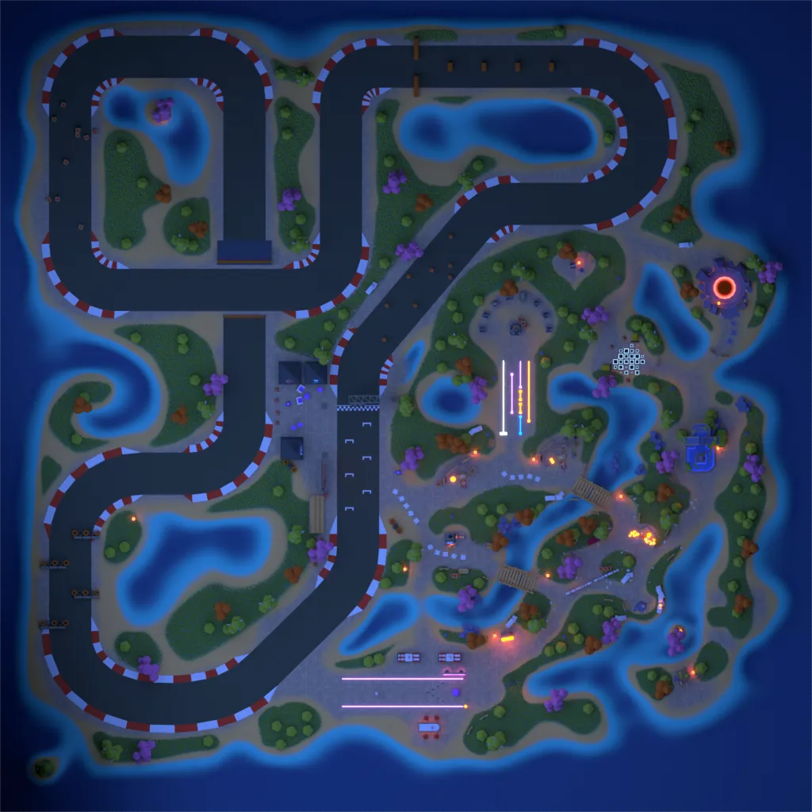
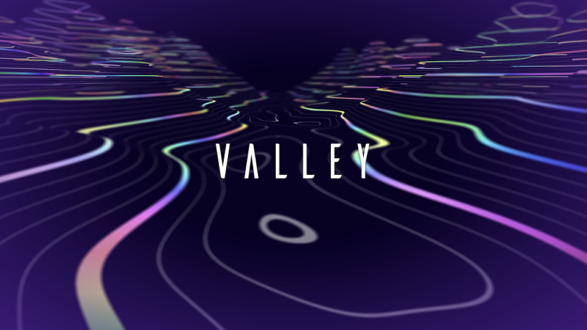
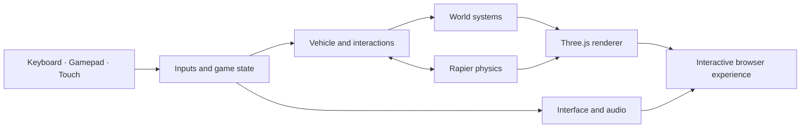

<div align="center">

### Documentation language

[](./README.md)
[](./README.es.md)

<br />

# Interactive 3D Portfolio Starter

### A game-like foundation for building an explorable portfolio on the web.

[](https://threejs.org/)
[](https://rapier.rs/)
[](https://vite.dev/)
[](https://www.khronos.org/webgl/)

</div>



<p align="center"><sub>Visual concept created from the project's world, vehicle, palette, and low-poly art direction.</sub></p>

## Build a portfolio people can explore

This project replaces the usual scroll-only portfolio with a small interactive world. Visitors drive through the environment, discover content areas, open projects, complete activities, and experience a world that changes with time and weather.

It is intended as a **starting point for a new experience**. Replace the current content, visual identity, world assets, links, and copy with your own before publishing it.

<table>
  <tr>
    <td width="33%" valign="top">
      <h3>Explore</h3>
      <p>A driveable open world connects projects, experiments, social links, and interactive areas.</p>
    </td>
    <td width="33%" valign="top">
      <h3>Interact</h3>
      <p>Physics, achievements, activities, notifications, audio, and multiple input methods make the visit feel playful.</p>
    </td>
    <td width="33%" valign="top">
      <h3>Evolve</h3>
      <p>Day, season, lighting, fog, wind, rain, snow, and other world systems create a living atmosphere.</p>
    </td>
  </tr>
</table>

## The experience at a glance

<table>
  <tr>
    <td width="50%" align="center">
      
    </td>
    <td width="50%" align="center">
      
    </td>
  </tr>
  <tr>
    <td align="center"><strong>Flexible controls</strong><br /><sub>Keyboard, gamepad, touch, and pointer-based interactions.</sub></td>
    <td align="center"><strong>Discoverable progress</strong><br /><sub>Achievements and activities reward exploration.</sub></td>
  </tr>
</table>

### One world, different moods

<table>
  <tr>
    <td width="50%" align="center">
      
    </td>
    <td width="50%" align="center">
      
    </td>
  </tr>
  <tr>
    <td align="center"><strong>Day</strong></td>
    <td align="center"><strong>Night</strong></td>
  </tr>
</table>

### Space for experiments



The world already includes areas for projects, laboratory experiments, challenges, an achievement altar, a circuit, and other interactive discoveries. These modules can be reused, reduced, or replaced to fit a completely new portfolio.

## What is already included

- A vehicle-based exploration system with arcade-style handling and respawning.
- Real-time 3D rendering built with Three.js and node-based materials.
- Rapier physics for the vehicle, collisions, objects, and world interactions.
- Day and year cycles connected to weather, lighting, fog, foliage, and terrain.
- Rain, snow, wind, lightning, water, tracks, trails, and environmental effects.
- Project, laboratory, circuit, bowling, social, map, menu, and achievement areas.
- Keyboard, gamepad, touch, and pointer input systems.
- Music, effects, spatial audio, notifications, and interactive prompts.
- A GLB, texture, KTX, and WebP optimization pipeline for production assets.
- An optional WebSocket connection for online functionality.

## How the pieces connect



| Layer | Responsibility |
| --- | --- |
| Experience | Intro, menus, map, controls, notifications, projects, and content panels |
| Gameplay | Player, vehicle, interactions, activities, achievements, and respawns |
| World | Areas, terrain, objects, vegetation, cycles, weather, lighting, and effects |
| Engine | Time, resources, inputs, physics, audio, camera, rendering, and monitoring |
| Pipeline | Vite build, 3D model processing, texture compression, and static delivery |

## Quick start

### Requirements

- [Node.js](https://nodejs.org/) 20.19+ or 22.12+.
- npm.
- A modern browser with WebGL support.

### Install and run

```bash
git clone <your-repository-url>
cd <your-project-folder>
npm install --force
npm run dev
```

Open the local URL printed by Vite, normally `http://localhost:5173`.

> `--force` is currently required because one development plugin declares an older Vite peer-dependency range. Review and upgrade that plugin before using this starter in long-term production.

### Production build

```bash
npm run build
npm run preview
```

The optimized output is generated in `dist/`.

## Main controls

| Action | Keyboard | Gamepad |
| --- | --- | --- |
| Move | `WASD` or arrow keys | Left stick / directional controls |
| Boost | `Shift` | Circle / equivalent face button |
| Brake | `B` or left `Ctrl` | Square / equivalent face button |
| Jump / suspension action | `Space` | Triangle / equivalent face button |
| Interact | `Enter`, `E`, or `F` | Cross / primary face button |
| Respawn | `R` | Select / view button |
| Open map | `M` | Available through the interface |
| Change view | `V` | Available through the interface |
| Close a panel | `Esc` | Primary face button |

Touch controls appear automatically on compatible devices. Input availability can also depend on the current activity or interface state.

## Environment configuration

Create a `.env` file in the project root when you need to override runtime behavior.

| Variable | Purpose |
| --- | --- |
| `VITE_GAME_PUBLIC` | Enables the public experience flow. |
| `VITE_COMPRESSED` | Loads compressed model and texture variants. |
| `VITE_MUSIC` | Enables background music. |
| `VITE_SERVER_URL` | WebSocket endpoint used by optional online features. |
| `VITE_WHISPERS_COUNT` | Sets the number of generated world messages. |
| `VITE_PLAYER_SPAWN` | Selects the initial respawn point; defaults to `landing`. |
| `VITE_DAY_CYCLE_PROGRESS` | Forces a specific day-cycle progress value for testing. |
| `VITE_YEAR_CYCLE_PROGRESS` | Forces a specific year-cycle progress value for testing. |
| `VITE_LOG` | Enables additional console logging. |
| `VITE_ANALYTICS_TAG` | Supplies the analytics measurement tag used by the page template. |

Example development configuration:

```dotenv
VITE_GAME_PUBLIC=true
VITE_WHISPERS_COUNT=0
```

The boolean-style flags in the current source are enabled when they contain any non-empty value. To disable `VITE_COMPRESSED` or `VITE_MUSIC`, leave those variables undefined instead of assigning `false`.

Do not commit secrets. Variables prefixed with `VITE_` are exposed to the browser bundle.

## Project structure

```text
.
├── docs/images/       README artwork and project previews
├── resources/         Source resources used during content creation
├── scripts/           Asset-processing utilities
├── sources/           Application, interface, styles, and game systems
│   └── Game/          Rendering, physics, input, world, and gameplay modules
├── static/            Models, textures, audio, fonts, and public assets
├── vite.config.js     Development and production build configuration
└── package.json       Commands and JavaScript dependencies
```

## Asset workflow

Keep editable source files separate from the browser-ready versions. After exporting uncompressed 3D assets, run:

```bash
npm run compress
```

The compression script scans `static/` and can:

- Create optimized GLB variants while preserving their source files.
- Encode model textures into GPU-friendly KTX formats.
- Convert interface images to WebP.
- Apply path-specific compression presets.

The script depends on external tools from the glTF Transform and Khronos KTX ecosystems. Review `scripts/compress.js` before running it on new assets.

## Turn it into your own project

Before publishing a new portfolio, plan to replace at least:

1. Page metadata, copy, projects, links, and contact information.
2. Logos, social images, interface branding, fonts, and color decisions.
3. World models, textures, audio, project screens, and laboratory content.
4. Analytics, server endpoints, environment variables, and deployment settings.
5. License notices and third-party attributions according to their original terms.

Start with one area, one project, and one clear visitor journey. Once that path feels good, expand the world without making the first visit harder to understand.

## Performance notes

This is a large real-time 3D experience, so the first load is heavier than a conventional portfolio. For a production fork:

- Enable compressed assets and test on mid-range mobile hardware.
- Remove unused areas, models, audio, and dependencies.
- Split optional experiences when they do not belong in the initial journey.
- Measure loading, memory, frame rate, and battery use on real devices.
- Provide a clear loading state and a simpler fallback when appropriate.

## License and attribution

Review [`license.md`](./license.md) and every license or attribution bundled with assets before redistributing or publishing this base. Preserve all notices required by the original code, fonts, models, textures, audio, and third-party libraries.

---

<div align="center">

**A strong foundation for a completely new interactive portfolio.**

[](./README.md)
[](./README.es.md)

</div>
